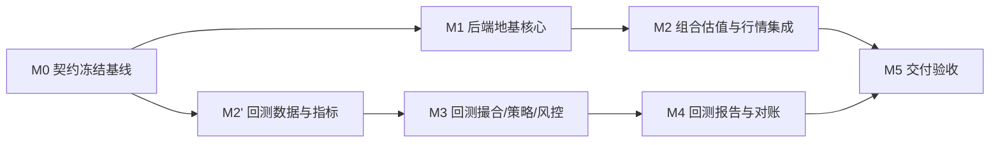

# 核心后端实施计划（RM1 + RM2）

> 计划依据：`doc/technical/roadmap/02_backend_foundation.md`（RM1）、`doc/technical/roadmap/03_backtest_engine.md`（RM2），及其引用的领域/配置/回测设计文档。
> 参照模板：`doc/technical/market_information_service/implementation_plan/`（同一套流程已在行情服务 M0–M4 验证有效）。
> 当前状态：规划中。
> 最近更新：2026-08-05

## 1. 使用方式

任务状态沿用仓库统一约定（`.claude/standards/development-workflow.md` §3）：

- `TODO`：尚未开始。
- `READY`：依赖已满足，可以领取。
- `IN_PROGRESS`：正在实现，必须有唯一负责人。
- `BLOCKED`：存在明确阻塞条件，需记录原因。
- `DONE`：产出、测试和完成条件全部满足。

任一任务只有同时满足「输出 + 测试 + 完成条件」才可标记 `DONE`。覆盖率达标不能替代业务边界、并发和事务测试。

## 2. 专题计划

1. [契约冻结与领域地基](./01_contracts_and_foundation.md)（BE-001、BE-002）
2. [组合估值与行情集成](./02_portfolio_and_market_integration.md)（BE-003、BE-003a、BE-004a、BE-004）
3. [回测数据与指标](./03_backtest_data_and_indicators.md)（BT-001、BT-002）
4. [回测撮合、策略与风控](./04_backtest_matching_strategy_risk.md)（BT-003、BT-004、BT-005）
5. [回测报告与对账](./05_backtest_reporting_and_reconciliation.md)（BT-006、BT-007）

## 3. 里程碑

| 里程碑 | 目标 | 退出条件 |
| --- | --- | --- |
| M0 契约冻结基线 | 领域接口、Strategy/RiskPolicy 签名、初版 DDL、行情服务批量精度 API 契约全部冻结 | 见 `01_contracts_and_foundation.md` §0；冻结前不得并行实现 BE-001 之后的任务 |
| M1 后端地基核心 | 领域分包骨架 + 持久化落地（BE-001、BE-002） | 目录符合 python 规范；PostgreSQL + Alembic migration 可重复执行；旧接口不回归 |
| M2 组合估值与行情集成 | 估值快照生成 + 行情服务契约打通（BE-003、BE-003a、BE-004a、BE-004） | 净值可逐项对账；三个标的精度规则可通过批量 API 一次查到；`USDT→USD` 历史汇率可查询；两服务不共表 |
| M2' 回测数据与指标 | 历史数据装载 + 指标库（BT-001、BT-002，可与 M1/M2 并行） | 自然日对齐序列无跳空；指标输出符合 `04_analysis_modules.md` |
| M3 回测撮合、策略与风控 | 事件驱动回测循环 + 策略/风控接口（BT-003、BT-004、BT-005） | 固定输入可复现；权重/持仓数/精度约束生效；风控可被 paper 复用 |
| M4 回测报告与对账 | 绩效指标 + 报告产出（BT-006、BT-007） | 逐日对账通过；报告含完整风险指标与撮合假设 |
| M5 RM1+RM2 交付验收 | 两条线交付物汇合，为 RM3 铺垫 | M2 与 M4 全部退出条件满足；策略/风控代码确认可被 paper 直接复用 |

## 4. 关键依赖

M1 与 M2' 在 M0 冻结后即可并行；M2 依赖 M1（复用同一批 repository/持久化基础设施）；M3 依赖 M2' 的指标产出，不依赖 M2（回测数据装载走行情服务查询接口，不依赖 backend 领域模型落地进度）。

## 5. 并行波次

| 波次 | 可并行工作 | 必须先冻结 |
| --- | --- | --- |
| W1 | 领域子包接口签名、Strategy/RiskPolicy 接口签名、PostgreSQL 初版 DDL 草案、行情服务批量精度 API 契约草案 | 无（本波次即冻结过程本身） |
| W2 | BE-001 领域分包骨架、BE-004a（market-info-service 侧新增字段与批量端点）、BT-001 历史数据装载 | W1 冻结的接口签名与 DDL 表清单 |
| W3 | BE-002 持久化落地、BT-002 指标计算库 | 表结构与 Repository 接口（W1/W2 产出） |
| W3.5 | BE-003a（market-info-service 侧新增 CoinGecko FX provider，DEC-006） | 无（依赖 DEC-006 已决策，与 W2/W3 可并行，因为是 market-info-service 独立目录） |
| W4 | BE-003 组合估值快照、BE-004 行情集成客户端、BT-004 策略接口实现、BT-005 风控接口实现 | Strategy/RiskPolicy 接口签名、BE-004a 已上线、BE-003a 已上线 |
| W5 | BT-003 事件驱动回测循环（由单一负责人实现，集中承载状态机与撮合语义，理由同 market-info-service DB-013） | BT-004、BT-005 的接口（不要求完整实现，签名冻结即可） |
| W6 | BT-006 绩效对账、BT-007 回测报告；同步验收 RM1（BE-003/004）与 RM2（BT-006/007）退出条件 | BT-003 产出的逐日权益记录 |

同一波次并行不代表可以绕过依赖。共享接口、migration、依赖清单、路由注册、Compose 和 CI 文件由整合负责人统一修改。BE-004a 修改 `market-info-service`（Go），其余任务修改 `backend`（Python），两者天然是不同目录/不同写入者，可分别占用「执行 Agent」名额而不冲突。

## 6. 当前进度

| 任务 | 状态 | 说明 |
| --- | --- | --- |
| RM0 DEC-001/002/003/005 | DONE | 已写入需求文档与对应规范，RM0 退出条件已满足 |
| M0 契约冻结（CONTRACT-001~005） | DONE（已冻结，2026-08-05） | 签名/DDL/API schema 已写入 `01_contracts_and_foundation.md`、`02_portfolio_and_market_integration.md`，已经你确认冻结 |
| BE-001、BE-004a | DONE（2026-08-05） | 详见各自专题计划文档；BE-004a 发现 BTC-USDT 精度因网络限制暂为占位值，RM3/RM5 前需核实 |
| BE-002、BT-001 | DONE（2026-08-05） | 详见 `01_contracts_and_foundation.md`、`03_backtest_data_and_indicators.md`；BE-002 提出的 3 个契约问题已由整合负责人裁定（`broker_code` 参数已修正并重新测试通过，另两个确认无需改动），BT-001 的美股节假日日历不含临时性闭市 |
| DEC-006（汇率数据来源） | DONE（2026-08-05） | BE-002 落地过程中发现汇率数据源从未定义，补充决策：建模为 market-info-service 的 `FX` 类型 Instrument，新增 CoinGecko provider；详见 `roadmap/01_decisions.md` DEC-006、需求文档 §5.1.2 |
| BE-004、BT-002 | DONE（2026-08-11） | 详见 `02_portfolio_and_market_integration.md`、`03_backtest_data_and_indicators.md`；BE-004 留了一个明确的遗留待办（`asset_id`→`instrument_code` 解析器，故意做成待注入的 Protocol，未擅自猜映射规则） |
| BE-003a | DONE（2026-08-15） | 详见 `02_portfolio_and_market_integration.md`；新增 CoinGecko provider + `FX` 类型（domain 枚举 + core CHECK 约束），常驻采集调度；顺手发现并修了两个预先存在的 bug（`test-integration.sh` 漏加载 `002_core_catalog_seed.sql` 导致集成测试基线本就是坏的；`schedulingMarket`/`providerScopeFor` 对未知资产类型组合会中断整个调度扫描，不只是当前订阅） |
| BT-004 | DONE（2026-08-15） | 详见 `04_backtest_matching_strategy_risk.md`；`SimpleRuleStrategy` 落地，留了 4 条遗留待办（domain→backtest 依赖、`trading_status` 填充责任、`candidate` 状态是否该买入、默认阈值均为判断非钉死值） |
| BE-003 | READY | 依赖的 BE-002/DEC-002/BE-003a 均已完成 |
| BT-005 | READY | 依赖的 BT-004、CONTRACT-003 均已就绪 |
| 其余任务（BT-003、BT-006~007） | TODO | 依赖尚未满足，按 README §5 并行波次顺序推进 |

## 7. 首期明确不做

- 多策略组合、策略回测参数寻优/网格搜索。
- 实盘执行适配器（长桥下单 API 接入留给 RM4/RM5）。
- 期权、融资融券、做空、杠杆（与需求文档 §2.2 非目标一致）。
- gRPC/protobuf（按 `.claude/standards/project-conventions.md` §2 的触发条件延后）。
- 前端可视化改造（复用现有基础可用前端，不在本计划范围内新增页面）。
- 小时线/分钟线回测（首期只做日线，留待后续按需扩展）。

## 8. Agent 协作规则

沿用 `.claude/standards/development-workflow.md` §5 的仓库级规则，此处不重复；仅补充本计划的具体应用：

- 同时最多 3 个执行 Agent + 1 个整合 Agent；本计划中 `market-info-service`（BE-004a）与 `backend`（其余任务）是天然独立的写入目录。
- BT-003（事件驱动回测循环）不拆给多个 Agent 并行，由单一负责人实现并对接 BT-004/BT-005 的已冻结接口。
- 共享接口、DDL、行情服务 API 契约、Alembic 迁移顺序须在 W1 由整合负责人统一冻结后才可进入 W2 及以后的并行实现。
