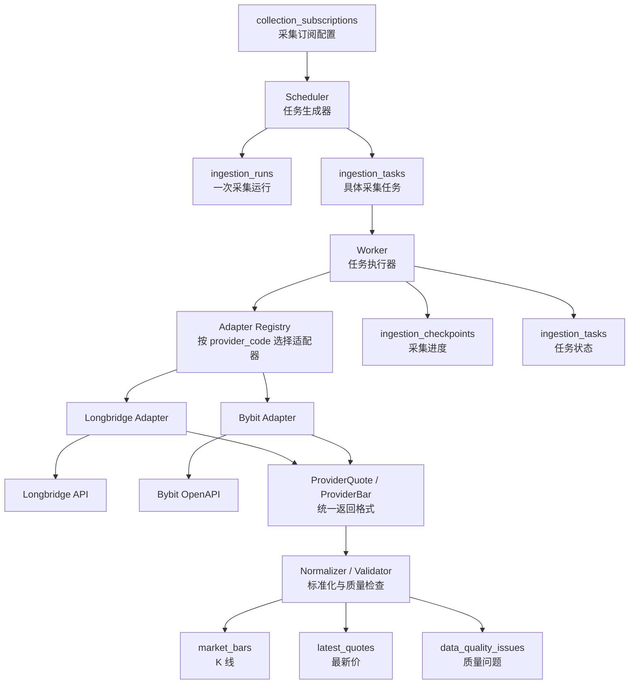
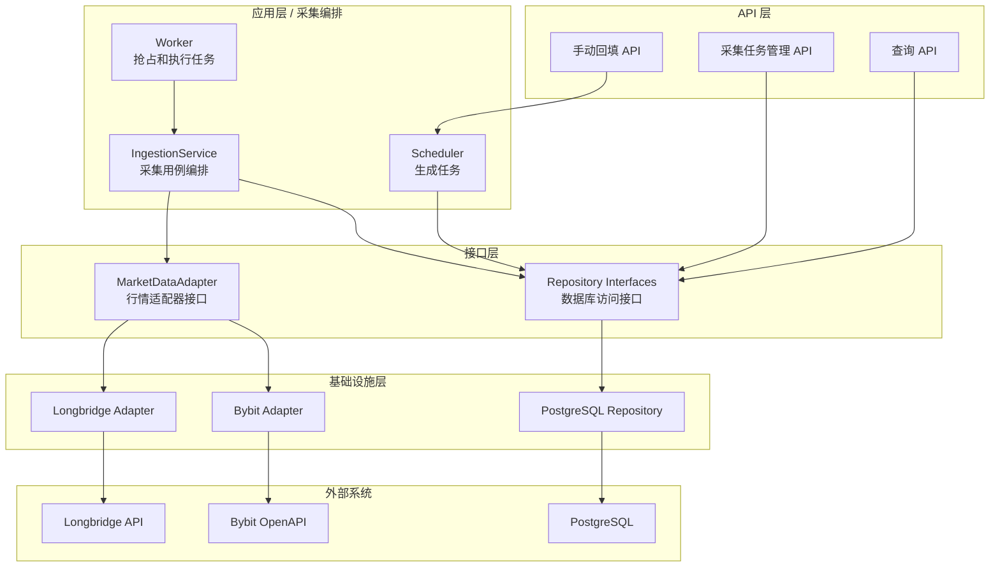
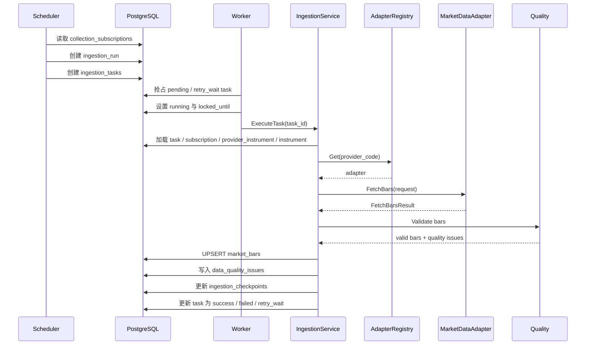

# 市场资讯服务采集流程设计

> 来源：拆分自 `../11_market_information_database.md`。

## 7. 采集流程设计

采集流程分为两条主线：

- 调度线：根据长期订阅配置、交易日历、checkpoint 和缺口检测结果生成可执行任务。
- 执行线：Worker 抢占任务，通过统一 adapter 获取数据，标准化并幂等写入数据库。

### 7.1 数据流图


### 7.2 服务组件层次



核心依赖关系：

```text
Worker -> IngestionService -> MarketDataAdapter interface -> concrete provider adapter
```

Worker 可以复用底层 adapter，但必须通过 `MarketDataAdapter` 接口和 `AdapterRegistry` 间接使用，不能直接依赖 `longbridge.Adapter` 或 `bybit.Adapter`。
### 7.3 组件职责

| 组件 | 职责 | 不负责 |
| --- | --- | --- |
| Scheduler | 读取订阅、判断到期窗口、创建 Run 和 Task | 调用供应商 API、写入行情 |
| Worker | 抢占任务、维护租约、调用采集用例、更新任务状态 | 解析供应商字段、决定数据源优先级 |
| IngestionService | 加载上下文、选择 adapter、调用采集、标准化、质量检查、写库、推进 checkpoint | 管理外部凭据、直接处理 HTTP 细节 |
| AdapterRegistry | 根据 `provider_code` 返回适配器实现 | 判断业务优先级 |
| MarketDataAdapter | 调用外部行情 API、处理分页/限流/错误分类、返回统一 DTO | 生成任务、写数据库、跨源合并行情 |
| Repository | 封装 PostgreSQL 查询、任务抢占、幂等写入和状态更新 | 处理供应商协议 |
### 7.4 K 线任务执行流程



最新行情任务与 K 线任务复用同一执行框架，只是调用 `FetchLatestQuotes` 并写入 `latest_quotes`。第一阶段可以先以轮询方式实现最新行情，WebSocket 留作后续优化。
### 7.5 调度线流程

Scheduler 不直接采集数据，只负责创建任务。

基本步骤：

1. 扫描启用的 `collection_subscriptions`。
2. 读取对应 `ingestion_checkpoints`。
3. 根据 interval、市场时间、close delay、revision delay 和当前时间计算应采集窗口。
4. 对比 `market_bars` 实际数据，识别 checkpoint 之后仍缺失的区间。
5. 按供应商能力、分页限制和任务粒度拆分成 `ingestion_tasks`。
6. 创建 `ingestion_runs` 和任务集合。
7. 对同一调度时点生成稳定 `run_key`，避免重复创建。

Scheduler 可以调用 adapter 的 `Capabilities()` 做启动检查或配置校验，但不调用 `FetchBars()` 或 `FetchLatestQuotes()`。
### 7.6 执行线流程

Worker 负责消费任务。

基本步骤：

1. 使用 `SELECT ... FOR UPDATE SKIP LOCKED` 抢占可执行任务。
2. 设置 `status = running`、`locked_by`、`locked_until`、`started_at` 和 `attempt_count`。
3. 调用 `IngestionService.ExecuteTask(task_id)`。
4. `IngestionService` 加载订阅和供应商品种上下文。
5. 通过 `AdapterRegistry` 获取 `MarketDataAdapter`。
6. 调用 adapter 获取统一 DTO。
7. 执行时间、OHLC、成交量、闭合状态和来源校验。
8. 幂等写入 `market_bars` 或 `latest_quotes`。
9. 写入或更新 `data_quality_issues`。
10. 在同一事务中更新 checkpoint 与 task 状态。

Worker 退出或崩溃时，超过 `locked_until` 的任务可被其他 Worker 重新抢占。由于行情写入具备幂等约束，重复执行同一任务不会生成重复行情。
### 7.7 Checkpoint 与缺口检测

Checkpoint 是生成增量任务的加速信息，不是完整性事实来源。

- 成功写入已闭合 K 线后才能推进 `last_success_open_time`。
- 未闭合 K 线不推进历史 checkpoint。
- Provider 超时、返回不完整或任务失败时不推进 checkpoint。
- 修订任务和 repair 任务可以重采 checkpoint 之前的时间范围。
- 缺口检测必须查询 `market_bars`，不能只看 `ingestion_checkpoints`。
