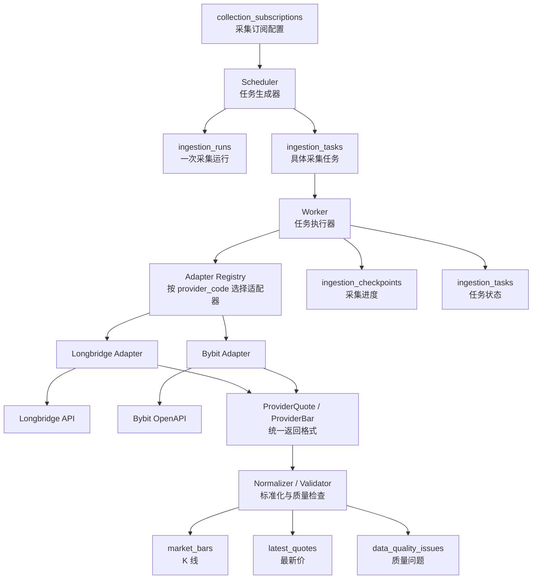
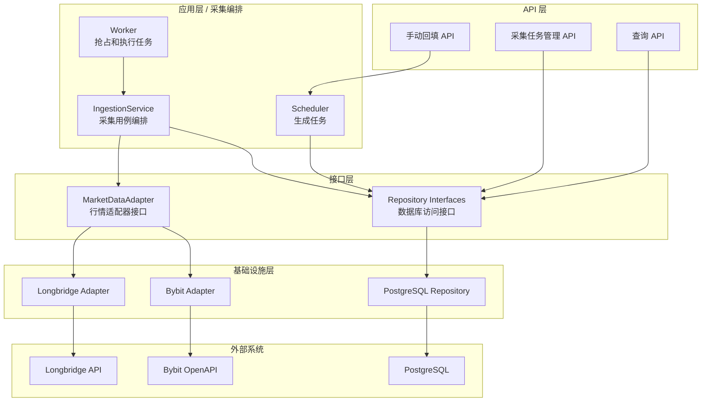
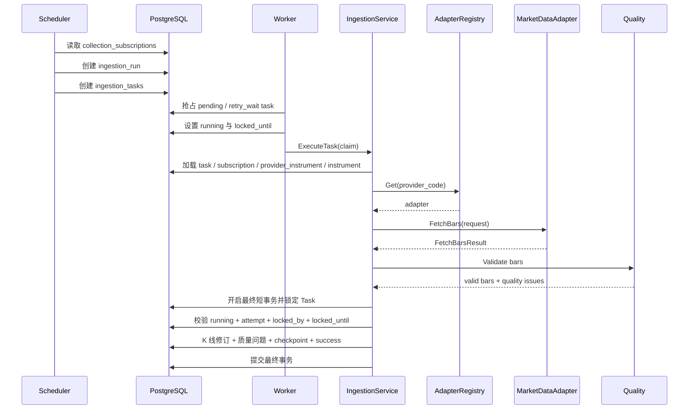

# 市场资讯服务采集流程设计

> 来源：拆分自 `../11_market_information_database.md`。

## 7. 采集流程设计

采集流程分为两条主线：

- 调度线：根据长期订阅配置、交易日历、checkpoint 和缺口检测结果生成可执行任务。
- 执行线：Worker 抢占任务，通过统一 adapter 获取数据，标准化并幂等写入数据库。

### 7.1 数据流图


### 7.2 服务组件层次



核心依赖关系：

```text
Worker -> IngestionService -> MarketDataAdapter interface -> concrete provider adapter
```

Worker 可以复用底层 adapter，但必须通过 `MarketDataAdapter` 接口和 `AdapterRegistry` 间接使用，不能直接依赖 `longbridge.Adapter` 或 `bybit.Adapter`。
### 7.3 组件职责

| 组件 | 职责 | 不负责 |
| --- | --- | --- |
| Scheduler | 读取订阅、判断到期窗口、创建 Run 和 Task | 调用供应商 API、写入行情 |
| Worker | 抢占任务、维护租约、调用采集用例、更新任务状态 | 解析供应商字段、决定数据源优先级 |
| IngestionService | 加载上下文、选择 adapter、调用采集、标准化、质量检查、写库、推进 checkpoint | 管理外部凭据、直接处理 HTTP 细节 |
| AdapterRegistry | 根据 `provider_code` 返回适配器实现 | 判断业务优先级 |
| MarketDataAdapter | 调用外部行情 API、处理分页/限流/错误分类、返回统一 DTO | 生成任务、写数据库、跨源合并行情 |
| Repository | 封装 PostgreSQL 查询、任务抢占、幂等写入和状态更新 | 处理供应商协议 |
### 7.4 K 线任务执行流程



最新行情任务与 K 线任务复用同一执行框架，只是调用 `FetchLatestQuotes` 并写入 `latest_quotes`。第一阶段可以先以轮询方式实现最新行情，WebSocket 留作后续优化。
### 7.5 调度线流程

Scheduler 不直接采集数据，只负责创建任务。

基本步骤：

1. 扫描启用的 `collection_subscriptions`。
2. 读取对应 `ingestion_checkpoints`。
3. 根据 interval、市场时间、close delay、revision delay 和当前时间计算应采集窗口。
4. 对比 `market_bars` 实际数据，识别 checkpoint 之后仍缺失的区间。
5. 按供应商能力、分页限制和任务粒度拆分成 `ingestion_tasks`。
6. 创建 `ingestion_runs` 和任务集合。
7. 对同一调度时点生成稳定 `run_key`，避免重复创建。

Scheduler 可以调用 adapter 的 `Capabilities()` 做启动检查或配置校验，但不调用 `FetchBars()` 或 `FetchLatestQuotes()`。

#### SCH-001 连续市场时间窗口

`internal/scheduler` 已实现不访问数据库和 Provider 的连续市场纯窗口算法。Scheduler 为每个 close 或 revision trigger 提供 `interval`、该 trigger 的“下一根尚未调度 K 线 open time”、delay 和当前观测时间；计算器返回一个 interval 对齐的 `[range_start, range_end)`，或在尚无 K 线到期时返回空窗口。`range_start` 必须已经对齐 UTC 周期边界，避免计算器静默扩大或缩小调用方指定的恢复范围。

第一阶段连续市场规则固定为：

- `1h` 以 UTC 整点为边界，`1d` 以 UTC 00:00 为日切；该规则适用于 Bybit 7×24 现货，不用于美股。
- 一根 K 线在 `close_time + delay` 时精确到期；边界前一纳秒仍不可调度，边界时刻可以调度。
- `close_delay_seconds` 和 `revision_delay_seconds` 都从 K 线 close time 独立计算。revision 为 `null` 时不产生 revision 窗口；首期不额外要求 revision delay 大于 close delay。
- close 与 revision 使用相同算法，但必须分别提供各自的 next open time，不能用初次采集 checkpoint 覆盖修订进度。
- 服务重启后，`next_open_time` 到当前最新已到期 close boundary 之间的多根 K 线合并为一个连续窗口；若 next open 已等于或晚于该边界，则返回空，避免重复创建范围。
- `Clock` 只注入 `Now()`；具体窗口数学仍是显式接收 observed time 的纯函数，因此边界、重启和后续 Scheduler 测试不依赖真实时间。

SCH-001 不决定冷启动从多早开始、不读 checkpoint、不拆 Provider 分页，也不创建 Run/Task。上述持久化和稳定 `run_key` 属于 SCH-003/004；美股交易日、常规交易时段、提前休市、DST 与休市 freshness 属于 SCH-002。

#### SCH-002 美股交易日历与 freshness

`internal/markettime.TradingCalendar` 是 Scheduler、freshness 和 Provider K 线时间归一化共享的只读端口。首期 `NYSECalendar` 以 [NYSE Holidays & Trading Hours](https://www.nyse.com/trade/hours-calendars) 公布的数据为依据，明确支持 2026～2028：核心时段为美东 09:30～16:00，官方指定日期使用 13:00 提前收市；`America/New_York` 时区数据库负责 EST/EDT 转换。周末、完整休市日和提前收市日以显式日期表维护，并允许构造时注入临时休市或提前收市覆盖。

日历范围采取 fail closed：请求 2026～2028 之外的 session、上一/下一交易日或 K 线 close time 时返回 `ErrCalendarOutOfRange`，不得按普通工作日猜测。每年需要依据交易所新公布的日历扩展并测试支持窗口；临时全市场休市也必须通过覆盖更新。Longbridge Adapter 已通过相同端口计算 `1h/1d` 的 `close_time`，因此提前收市日的最后一根小时线会缩短，`is_closed`、Scheduler 和 freshness 不会各自维护不同的 16:00 假设。

美股 freshness 首期规则冻结为：

- `market_state=open` 只适用于核心时段 `[session.open, session.close)`；开盘时刻包含，收盘时刻不包含。
- 只将满足 `bar.close_time + close_delay <= observed_at` 的最近一根 K 线视为“应当已有”。`1h` 从 09:30 起按小时切分并在 session close 截断；`1d` 的存储 open key 仍是交易日期 UTC 00:00，close 使用该交易日真实 session close。
- 开市且尚无成功 checkpoint，或日历支持范围起点之前无法得到一根应有 K 线时返回 `freshness_status=unknown`、`data_delay_seconds=null`。
- 最新已闭合 open time 已达到期望 open time 时返回 `fresh` 和 `0`；落后时返回 `delayed`，delay 是实际 K 线 close 到期望 K 线 close 之间累计的核心交易时长。
- 有效交易时长会排除盘后、周末和完整休市，并按提前收市的真实 session 长度计算，所以 delay 不会在市场关闭期间增长。
- 只要当前不在核心时段，无论数据是否已经落后，都返回 `market_state=closed`、`freshness_status=not_applicable`、`data_delay_seconds=null` 和下一次核心开盘时间。休市前缺口仍由质量/修复流程处理，但不会使实时 scope 在休市期间降级。

SCH-002 只提供市场时间事实和纯状态投影，不查询健康数据、不汇总 Provider，也不暴露 HTTP；Repository 查询、scope/provider health 汇总和 `/providers/status` 路由仍属于 ADM-005。

#### SCH-003 增量 Scheduler 与稳定任务创建

`IncrementalScheduler.RunOnce` 在周期开始时只读取一次 `Clock.Now()`，并以该固定 `observed_at` 完成整轮分页扫描。Repository 按 Subscription UUIDv7 升序列出当前启用、Provider/Mapping/Instrument/Asset 有效且可执行历史 K 线的目标；Scheduler 使用 SCH-001/002 的时间算法分别计算 close trigger 和非空 revision trigger 的最新到期 K 线。Scheduler 的构造依赖只有 Store、Clock、UUIDv7 生成器和美股 Calendar，不持有 Adapter Registry，也不存在 `FetchBars/FetchLatestQuotes` 调用路径。

首期一个 `subscription + trigger + range` 固定创建一个 Run 和一个 Task，保持创建事务和失败边界简单：

- close trigger 使用 `run_type=incremental`，revision trigger 使用 `run_type=revision`，两者都是 `trigger_type=scheduler`。
- `scheduled_at` 是确定性的 `bar.close_time + delay`，`created_at` 才是本轮实际观测时间。调度较晚时保留原应执行时间，方便管理页面解释积压。
- 稳定 `run_key` 由 `run_type.scheduler.trigger.subscription_id.range_start.range_end` 构成，不包含进程 ID、Run UUID 或实际扫描时间。同一逻辑窗口由不同实例或后续周期观察时得到完全相同的 key。
- Repository 在短事务内以 `FOR SHARE` 重检 Subscription 仍启用，再以现有 `uq_ingestion_runs_key` 插入 Run。key 已存在时，只有 run type、trigger、scheduled time、subscription 和 range 全部等价才返回 `created=false`；同 key 描述不同工作返回 conflict，不能静默吞掉碰撞。
- Run 插入成功后才插入 Task，二者任一步或 commit 失败全部回滚。已存在的等价 key 不新增 Task。
- 一轮扫描后面页面失败不会删除前面已经提交的有效批次；下一轮通过稳定 key 重新扫描即可安全继续。
- Subscription 新建、启用或修改后，只在候选 K 线 `range_end > subscription.updated_at` 时创建 Task，因此不会把已闭合的旧窗口隐式解释为 backfill。

SCH-003 首次落地时每个 trigger 只创建“最新一根已经到期”的窗口；SCH-004 已在同一个 `RunOnce` 中为 close trigger 接入 checkpoint 续采、实际行情缺口检测和过期租约恢复。revision 仍保持只采最新到期窗口，避免把每次历史修订检查解释成必须逐根追赶。`RunOnce` 是可确定性测试和跨实例幂等的单次周期入口，worker/all 进程的定时驱动只需重复调用该入口，不得另写一套任务生成规则。

#### SCH-004 checkpoint 续采、缺口与租约恢复

`RunOnce` 固定一次 `observed_at` 后先调用 ING-004 已有的 `RecoverExpiredTasks`：过期 `running` Task 未耗尽尝试次数则回到 `pending`，耗尽则进入 `failed`，并原子记录 `lease_expired` 和失败 checkpoint。恢复失败时本轮立即停止，不在基础任务状态未知时继续创建新工作；恢复数量进入本轮结果，便于后续日志和指标上报。恢复只改变 Task 事实，不在 Repository 中计算 Run 状态；Run 查询缓存继续由 RunService 在后续状态转换或详情读取时纠偏。

close trigger 的续采规则冻结为：

- checkpoint 只是候选续采位置。若存在 `last_closed_open_time`，Scheduler 会按连续市场或美股交易日历枚举从 `subscription.updated_at` 到该位置的全部期望 K 线，并确认每个 open time 都存在当前、已闭合且质量为 `valid/warning` 的行情；整段验证成功才从 checkpoint 对应 K 线 close 后继续，不能仅凭最后一根存在推断前缀连续。
- checkpoint 不存在、指向的行情已删除/失效时，保守回退到 `subscription.updated_at`。首根候选仍遵守 `bar.close_time > updated_at`，不会隐式采集订阅启用前已经闭合的历史。
- 从续采边界到最新已到期 close 窗口枚举期望 K 线；加密货币按 UTC 1h/1d 连续边界，美股按真实 session、DST、休市和提前收市枚举。随后查询相同范围内的当前闭合 `valid/warning` 行情，只有不存在实际行情的 open time 才是缺口。
- 相邻的期望缺口合并为一个 Task；中间已有行情会切断范围，避免无意义重采。聚合 Task 的 `scheduled_at` 是最后一根缺失 K 线的 `close + delay`，稳定 `run_key` 规则不变，因此跨实例和重启仍然幂等。
- 完整性扫描覆盖订阅启用边界到最新到期窗口；默认每个聚合 Task 最多包含 500 根连续缺失 K 线、每订阅每轮最多创建 20 个缺口范围，可配置上限分别为 10000 和 100。冷启动或长停机超出单轮任务容量时由后续周期继续，避免一次制造无限队列。

SCH-004 不调用 Adapter、不新增 migration，也不根据 checkpoint 直接宣告数据完整。真实 PostgreSQL 测试已验证同一轮可以恢复过期租约并只为中间缺失的行情创建任务，第二轮通过稳定 key 返回 existing。

### 7.6 执行线流程

Worker 负责消费任务。

基本步骤：

1. 使用 `SELECT ... FOR UPDATE SKIP LOCKED` 抢占可执行任务。
2. 设置 `status = running`、`locked_by`、`locked_until`、`started_at` 和 `attempt_count`。
3. 调用 `IngestionService.ExecuteTask(claim)`；claim 携带 Task 和当前 Worker 租约，供最终事务校验所有权。
4. `IngestionService` 加载订阅和供应商品种上下文。
5. 通过 `AdapterRegistry` 获取 `MarketDataAdapter`。
6. 调用 adapter 获取统一 DTO。
7. 执行时间、OHLC、成交量、闭合状态和来源校验。
8. 幂等写入 `market_bars` 或 `latest_quotes`。
9. 写入或更新 `data_quality_issues`。
10. 在同一事务中更新 checkpoint 与 task 状态。

Worker 退出或崩溃时，超过 `locked_until` 的任务可被其他 Worker 重新抢占。由于行情写入具备幂等约束，重复执行同一任务不会生成重复行情。

ING-001 已将上述消费框架实现为 `internal/ingestion/worker`：

- `TaskClaimer` 只暴露原子认领方法，由 PostgreSQL `IngestionRepository` 实现；Worker 不直接拼接 SQL。
- `TaskExecutor` 是后续 `IngestionService` 的执行端口。Worker 只负责投递有效 claim，不解析 Provider 字段，也不决定任务成功、重试或失败状态。
- 一个 Worker 进程启动固定数量的 claim loop；每个 loop 同一时间只执行一个 Task，因此 `Concurrency` 是严格的进程内执行上限。多进程互斥仍由数据库行锁和租约保证。
- 无可执行任务时等待 `PollInterval`；认领失败时报告错误并等待 `ClaimErrorBackoff`，避免数据库故障期间形成忙循环。执行错误也会上报，但状态转换由执行器持久化。
- Worker 校验返回的 Task 已进入 `running`、`attempt_count > 0`、`locked_by` 是当前 Worker 且 `locked_until` 有效，异常 claim 不会进入执行器。
- 服务取消 `context` 后，空闲等待立即退出，运行中的 `TaskExecutor` 通过同一 `context` 协作式停止。执行器必须响应取消；最终零污染仍由 ING-002/ING-004 的事务所有权检查保证。
- 首期使用固定 `LeaseDuration`，不实现心跳续租。租约应覆盖常规单 Task 耗时；长历史回填的续租机制在任务确实变长后再设计。

用于测试的 `Clock` 端口统一提供认领时间和可取消等待，使空队列轮询、错误退避与关闭流程不依赖真实睡眠。生产默认使用系统 UTC 时间和 `time.Timer`。

#### ING-002 K 线采集与最终事务

首期 `collection_subscriptions.interval` 只有 `1h` 和 `1d`，所以持久 Task 的执行闭环是 K 线采集。最新行情仍使用同一个 `MarketDataAdapter`，但在定义独立的最新行情轮询任务语义前，不把 K 线订阅解释成 quote Task。

`IngestionService.ExecuteTask(claim)` 的执行顺序已经固定为：

1. 校验 claim 仍为未过期的 `running` 租约，然后在事务外加载 Subscription、Asset、Instrument、ProviderInstrument 和 Provider。
2. 校验订阅启用、实体关系、Provider/Instrument 状态、映射启用状态以及 mapping 对 interval 的历史行情能力。
3. 从 `AdapterRegistry` 选择 Adapter。每一页请求前再次执行 capability/limit 校验，每一页响应后再次执行统一 DTO 契约校验，不能只信任具体 Adapter 自检。
4. Provider 分页全部在事务外完成。跨页 open time 不得重复；到达 `MaximumPages` 仍有下一页时任务失败，防止异常 cursor 导致无限循环。全部页面结束后按 open time 全局升序排列。
5. 结构质量校验将闭合 K 线标记为 `valid`，未闭合快照标记为 `warning`。OHLC、负成交量、来源、interval、时间范围等硬错误阻断整个 Task，不允许部分落库。缺口判断依赖 SCH-002 交易日历，本阶段不按固定时长臆测美股缺口。
6. `raw_hash` 由标准化时间、OHLCV、trade count 和闭合状态生成，不包含采集时间和传输 JSON 格式；同一行情重复获取不会产生伪修订。Adapter 已脱敏的 `RawPayload` 包装在 K 线 metadata 的 `provider_payload` 中。
7. Provider 和质量处理全部成功后，才调用 `CommitSuccess` 开启最终短事务。

最终事务按以下顺序执行：

1. `SELECT ... FOR UPDATE OF tasks` 锁定 Task，并联表取得该订阅的 ProviderInstrument、Instrument 和 interval。
2. 同时校验 `status = running`、`attempt_count`、`locked_by`、数据库中的 `locked_until` 与 claim 中的租约完全一致，且租约在提交时尚未过期。`attempt_count + locked_until` 是 fencing token，可阻止旧执行在同名 Worker 重新认领后提交。
3. 校验所有 K 线和质量问题都属于 Task 当前订阅的准确来源及 interval。
4. 在事务内完成 K 线当前版本关闭/新 revision 插入、开放质量问题幂等写入、checkpoint 更新和 Task `success`。
5. 任一步失败都回滚全部写入；Task 被取消、重新认领或租约过期时返回 `ErrTaskLeaseLost`，零行情、质量问题和 checkpoint 污染。

Checkpoint 只以本批次最大的已闭合 `open_time` 推进，未闭合 K 线不推进位置。数据库 upsert 使用单调最大值，历史 backfill 不会把较新的 checkpoint 倒退；成功提交会刷新 `last_attempt_at/last_success_at` 并清零连续失败次数。Task 成功事务提交后由 ING-005 的 RunService 根据 Task 事实刷新 Run 查询缓存。

#### ING-003 失败转换与自动重试

`IngestionService` 已负责完整的执行结果状态转换，Worker 仍只认领、投递和上报错误。Provider、上下文加载、质量处理或成功事务失败后，Service 先排除顶层任务 `context` 已取消/超时、未分类的原始 `context.Canceled/context.DeadlineExceeded` 和 `ErrTaskLeaseLost`；这些错误可能表示服务停止、人工取消或旧执行，不能覆盖数据库中的当前状态。Adapter 已分类的 `ProviderError` 优先于其底层 Cause，因此网络超时即使包装了 `context.DeadlineExceeded` 仍按 `network` 正常重试。其余错误按稳定类型分类，禁止匹配错误文本：

- Provider `network`、`rate_limited`、`temporary_unavailable`、`unknown`，以及领域层 `ErrDatabaseUnavailable`、`ErrRetryable` 可以自动重试。
- Provider `unauthorized`、`invalid_instrument`、`unsupported_interval`、`bad_request`、`invalid_response`，以及缺失/无效订阅映射、未注册 Adapter 等配置或契约错误直接失败。
- 未携带稳定临时错误标记的内部错误按 `internal_error` 终止，避免未知永久错误无限重试；确属暂时性的基础组件错误必须包装 `ErrDatabaseUnavailable` 或 `ErrRetryable`。

重试沿用原 Task，下一次认领时再增加 `attempt_count`。默认分段退避为 `1m / 5m / 15m / 30m / 60m`；第一阶段不加随机抖动，便于运维页面解释和确定性测试。Provider 提供有效 `Retry-After` 时优先采用，但默认最多等待 60 分钟。只要当前 `attempt_count >= max_attempts`，可重试错误也直接进入 `failed`。

失败状态也通过独立短事务提交：`SELECT ... FOR UPDATE` 后精确校验 `running + attempt_count + locked_by + locked_until` fencing token，随后刷新 checkpoint 的 `last_attempt_at`、累加 `consecutive_failures`，最后清除租约并进入 `retry_wait` 或 `failed`。该事务不写行情、不推进成功 open time；任一步失败全部回滚。Task 只保存白名单错误码、安全摘要和脱敏 JSON，例如 Provider 错误仅保留 `provider_code`，不保存 Adapter 的底层 Cause、响应正文、凭据或堆栈。Task 失败/重试事务提交后同样触发 RunService 刷新。

#### ING-004 协作式取消与过期租约恢复

首期协作式取消以数据库状态和最终 fencing 为安全边界，不维护跨实例的内存取消表，也不要求取消接口等待 Provider 请求退出。Service 取消 Task 时先锁定任务行：活动状态原子变为 `canceled` 并清空租约；不存在返回 not found，终态返回 conflict。旧 Worker 完成外部调用后，其成功或失败事务因状态、attempt 或租约不再匹配而返回 `ErrTaskLeaseLost`，因此不会写入行情、质量问题或成功 checkpoint。

过期 `running` 不再由普通 claim 查询直接抢占。统一恢复操作使用 `FOR UPDATE SKIP LOCKED`，未达到 `max_attempts` 的 Task 清空租约回到 `pending`，达到上限的 Task 直接进入 `failed`；两者都写入安全的 `lease_expired` 摘要并原子累计失败 checkpoint。多个恢复者并发时同一 Task 只处理一次。SCH-004 已在增量扫描前周期调用该恢复操作；ING-004 冻结的 Repository 语义和并发安全边界保持不变。

真实 PostgreSQL 并发测试覆盖了三条路径：运行中取消后旧 Worker 零写入；租约过期恢复后旧 Worker 零写入且新 Worker 可用下一 attempt 成功接管；到达尝试上限后直接失败。这里“零 checkpoint 污染”指旧 Worker 不能写成功位置，恢复操作自身记录的 `last_attempt_at/consecutive_failures` 是预期的失败事实。

#### ING-005 Run 状态汇总

RunService 从 `ingestion_tasks` 一次读取 `pending/running/retry_wait/success/failed/canceled` 六种状态计数以及任务时间边界，在应用层纯函数中归约出 `pending/running/success/partial/failed/canceled`。所有 pending 才是 pending；存在活动任务时为 running；不同终态混合统一为 partial。Run 表只保存 `task_count/success_count/failed_count` 等查询加速字段，Task 仍是最终事实。

汇总保存使用六种状态计数作为乐观快照条件。若 Provider 执行完成和 Run 回写之间又发生其他 Task 转换，旧快照更新零行并触发最多三次重新汇总，不会覆盖更新的事实。Run 刷新与 Task 最终事务有意分离：成功、失败或 retry_wait 已经落库后，Run 刷新故障只会上报缓存刷新错误，绝不再对已终态 Task 执行失败转换。后续 Task 转换和 Run 详情查询都能使用相同入口校正。

#### ING-006 单任务 backfill

BackfillService 接受一个 Provider、一个 Instrument、一个 `1h/1d` interval 和一个闭合历史范围，要求 `start_time < end_time <= now`。目标必须能解析到当前有效映射上的既有且启用 Subscription；Service 还会校验 Provider、Instrument、ProviderInstrument、历史能力和 interval 能力。`requested_by`、actor type、Request ID 与显式 reason 写入 Run 审计上下文。

创建操作只生成一个 `run_type=backfill/trigger_type=manual` 的 pending Run 和一个 pending Task，默认 `max_attempts=5`，并在同一短事务中落库。它不调用 Provider，也不等待 Worker；现有 Worker 认领后由 IngestionService 在这个 Task 内循环 Adapter cursor，Provider 的页数不会膨胀成数据库 Task 数量。历史成功仍使用 checkpoint 单调推进规则，不会让较老 backfill 倒退增量位置。

完全相同的 `subscription_id + range_start + range_end` 只在已有 backfill Task 仍为 `pending/running/retry_wait` 时冲突。Repository 在事务内对该规范化键取得 `pg_advisory_xact_lock(hashtextextended(...))`，随后检查活动 Task，再原子插入 Run/Task；因此跨实例并发请求也只能成功一个。这里不使用永久 unique key，因为 `success/failed/canceled` 后必须允许相同范围再次回填以产生行情修订；也不使用 Task 全局部分唯一索引，以免阻止增量或手动重试任务。底层返回 `ErrBackfillAlreadyRunning`，由 ADM-002 映射为 `409 BACKFILL_ALREADY_RUNNING`。

### 7.7 Checkpoint 与缺口检测

Checkpoint 是生成增量任务的加速信息，不是完整性事实来源。

- 成功写入已闭合 K 线后才能推进 `last_success_open_time`。
- 未闭合 K 线不推进历史 checkpoint。
- Provider 超时、返回不完整或任务失败时不推进 checkpoint。
- 失败尝试只刷新 `last_attempt_at` 并累加 `consecutive_failures`；后续成功再将连续失败次数清零。
- Worker 租约过期由恢复操作按失败尝试记录，不允许普通 claim 绕过该记录直接重新认领。
- 修订任务和 repair 任务可以重采 checkpoint 之前的时间范围。
- 缺口检测必须查询 `market_bars`，不能只看 `ingestion_checkpoints`。
