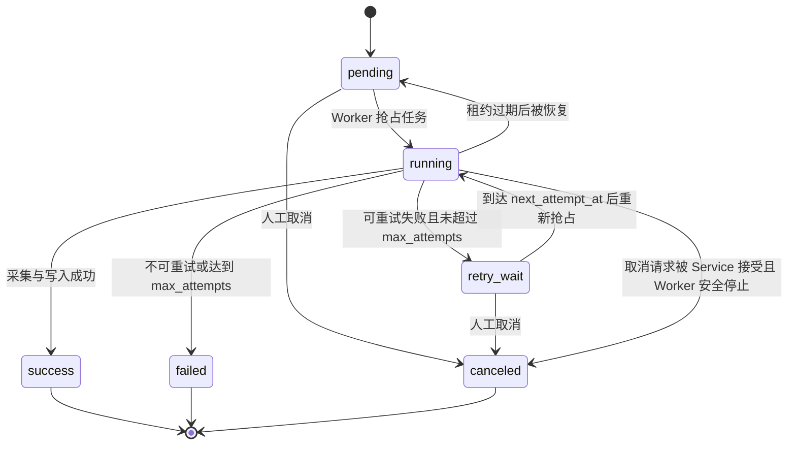

# 市场资讯服务任务生命周期设计

> 来源：拆分自 `../11_market_information_database.md`。

## 8. 任务生命周期设计

任务状态机已经落库到 `market_data.ingestion_tasks.status`，当前状态集合为：

```text
pending
running
retry_wait
success
failed
canceled
```

配套控制字段：

| 字段 | 用途 |
| --- | --- |
| `attempt_count` | 已尝试执行次数 |
| `max_attempts` | 最大重试上限 |
| `next_attempt_at` | 下一次允许重试时间 |
| `locked_by` | 当前认领任务的 Worker 标识 |
| `locked_until` | 当前任务租约过期时间 |
| `started_at` / `finished_at` | 任务开始与结束时间 |
| `error_code` / `error_message` / `error_details` | 失败原因 |

### 8.1 Task 状态机



状态说明：

| 状态 | 含义 |
| --- | --- |
| `pending` | 已创建，等待 Worker 抢占 |
| `running` | 已被某个 Worker 认领并正在执行 |
| `retry_wait` | 可重试失败，等待退避时间到达 |
| `success` | 数据采集、校验、写入和 checkpoint 更新完成 |
| `failed` | 不可重试失败，或超过最大尝试次数 |
| `canceled` | 被人工取消，不再执行 |

暂不增加 `timeout` 状态。超时通过 `status = 'running' AND locked_until < now()` 表达，由恢复逻辑将其重新变为 `pending` 或 `retry_wait`。

### 8.2 租约概念

租约是 Worker 对任务的“限时认领”。

当多个 Worker 同时运行时，必须避免两个 Worker 执行同一个任务。Worker 抢占任务时，会在同一事务中写入：

```text
status = running
locked_by = 当前 worker id
locked_until = now() + lease_duration
attempt_count = attempt_count + 1
started_at = now()
```

这表示：

- 在 `locked_until` 之前，该任务归 `locked_by` 对应的 Worker 执行。
- 其他 Worker 不应抢占这个任务。
- 如果 Worker 崩溃、进程退出或机器断开，租约不会永久占用任务。
- 当 `locked_until < now()` 时，系统可以认为该 Worker 已失联，并允许任务恢复。

租约不是业务锁，也不是数据库长事务。它只是数据库中的一组状态字段，用于实现“任务被谁临时认领，以及认领到什么时候过期”。

第一阶段可以不实现复杂的心跳续租；只要任务粒度足够小，`lease_duration` 大于常规单任务执行耗时即可。后续若历史回填任务变长，再增加 Worker 定期续租。

### 8.3 抢占任务规则

Worker 抢占任务时只选择：

```text
status = pending
OR (
  status = retry_wait
  AND next_attempt_at <= now()
)
OR (
  status = running
  AND locked_until < now()
)
```

推荐使用 `SELECT ... FOR UPDATE SKIP LOCKED`，并在同一事务中完成状态更新。

进入 `running` 时立即增加 `attempt_count`。这意味着只要 Worker 认领过任务，就算一次尝试；即使随后网络超时或进程崩溃，也能被重试上限覆盖。

### 8.4 失败分类与重试规则

可重试失败进入 `retry_wait`：

- 网络错误。
- DNS、TLS、连接超时、读超时。
- 供应商临时不可用。
- 供应商限流。
- PostgreSQL 等基础组件短暂不可用。
- 服务内部暂时性错误，例如连接池耗尽。

不可重试失败直接进入 `failed`：

- API Key 过期、无效或权限不足。
- 供应商品种不存在或映射错误。
- 订阅配置错误，例如 provider 不支持该 interval。
- 请求参数构造错误。
- 数据结构长期不兼容，需要人工修复 adapter。

重试判断：

```text
if retryable && attempt_count < max_attempts:
    status = retry_wait
    next_attempt_at = now() + backoff(attempt_count)
else:
    status = failed
```

`max_attempts` 第一阶段默认 5。退避策略建议使用指数退避并增加轻微抖动：

```text
1m, 5m, 15m, 30m, 60m
```

供应商返回明确 `Retry-After` 时优先使用供应商建议，但不得超过系统配置的最大等待时间。

### 8.5 成功提交规则

Task 成功提交时，以下操作必须在同一事务中完成：

1. 校验任务仍由当前 Worker 持有，即 `status = running` 且 `locked_by = current_worker_id`。
2. 写入或修订 `market_bars` / `latest_quotes`。
3. 写入或更新 `data_quality_issues`。
4. 推进 `ingestion_checkpoints`。
5. 更新任务为 `success`，清空租约字段，写入 `finished_at`。
6. 触发 Run 汇总状态刷新。

如果提交前发现任务已经被取消、租约已失效或 `locked_by` 不匹配，Worker 必须放弃提交。本次外部 API 调用即使已经发生，也不能写入数据库。

### 8.6 前端取消任务

前端取消任务的路径为：

```text
Frontend -> market-info-service API -> service 层检查任务状态 -> 更新任务状态
```

取消规则：

- `pending` 与 `retry_wait` 可以直接更新为 `canceled`。
- `success`、`failed`、`canceled` 为终态，不再取消。
- `running` 任务需要 service 层检查 `locked_by`、`locked_until` 和当前 Worker 状态。
- 若 Worker 已失联或租约过期，可直接取消。
- 若 Worker 仍在运行，第一阶段采用协作式取消：标记任务为 `canceled`，Worker 在提交前检查任务状态，发现已取消则放弃写入。

防止数据污染的关键点：

- Worker 的最终写库必须在事务里检查任务仍是自己持有的 `running` 状态。
- Service 取消任务时也必须更新同一行任务状态。
- 两边通过同一行任务记录形成并发控制，谁先拿到任务行锁，谁的状态变更先生效。
- 只要 Worker 没有通过最终提交事务，就不会写入行情、checkpoint 或质量问题。

### 8.7 Run 状态汇总

Run 状态不直接由数据库触发器维护，由 service 层根据 Task 汇总结果计算。

建议汇总规则：

| 条件 | Run 状态 |
| --- | --- |
| 所有任务仍未开始 | `pending` |
| 存在 `running`、`pending` 或 `retry_wait` | `running` |
| 全部任务 `success` | `success` |
| 部分 `success`，部分 `failed` 或 `canceled` | `partial` |
| 全部任务 `failed` | `failed` |
| 全部任务 `canceled` | `canceled` |

Run 汇总动作由以下场景触发：

- 创建任务后。
- Task 成功、失败、进入重试等待或取消后。
- 恢复租约过期任务后。
- 前端查询 Run 详情时可以按 Task 实时重算，用于校正计数。

`ingestion_runs.success_count`、`failed_count` 和 `task_count` 是查询加速字段，最终事实仍以 `ingestion_tasks` 为准。
