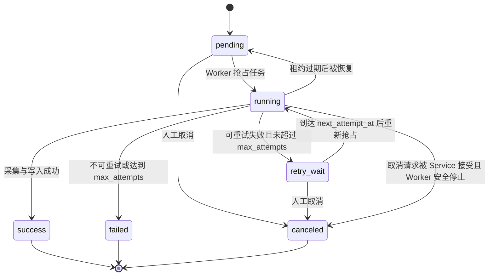

# 市场资讯服务任务生命周期设计

> 来源：拆分自 `../11_market_information_database.md`。

## 8. 任务生命周期设计

任务状态机已经落库到 `market_data.ingestion_tasks.status`，当前状态集合为：

```text
pending
running
retry_wait
success
failed
canceled
```

配套控制字段：

| 字段 | 用途 |
| --- | --- |
| `attempt_count` | 已尝试执行次数 |
| `max_attempts` | 最大重试上限 |
| `next_attempt_at` | 下一次允许重试时间 |
| `locked_by` | 当前认领任务的 Worker 标识 |
| `locked_until` | 当前任务租约过期时间 |
| `started_at` / `finished_at` | 任务开始与结束时间 |
| `error_code` / `error_message` / `error_details` | 失败原因 |
| `retry_of_task_id` | 手动重试生成的新任务所引用的原失败任务 |

### 8.1 Task 状态机



状态说明：

| 状态 | 含义 |
| --- | --- |
| `pending` | 已创建，等待 Worker 抢占 |
| `running` | 已被某个 Worker 认领并正在执行 |
| `retry_wait` | 可重试失败，等待退避时间到达 |
| `success` | 数据采集、校验、写入和 checkpoint 更新完成 |
| `failed` | 不可重试失败，或超过最大尝试次数 |
| `canceled` | 被人工取消，不再执行 |

暂不增加 `timeout` 状态。超时通过 `status = 'running' AND locked_until < now()` 表达，由恢复逻辑将其重新变为 `pending` 或 `retry_wait`。

### 8.2 租约概念

租约是 Worker 对任务的“限时认领”。

当多个 Worker 同时运行时，必须避免两个 Worker 执行同一个任务。Worker 抢占任务时，会在同一事务中写入：

```text
status = running
locked_by = 当前 worker id
locked_until = now() + lease_duration
attempt_count = attempt_count + 1
started_at = now()
```

这表示：

- 在 `locked_until` 之前，该任务归 `locked_by` 对应的 Worker 执行。
- 其他 Worker 不应抢占这个任务。
- 如果 Worker 崩溃、进程退出或机器断开，租约不会永久占用任务。
- 当 `locked_until < now()` 时，系统可以认为该 Worker 已失联，并允许任务恢复。

租约不是业务锁，也不是数据库长事务。它只是数据库中的一组状态字段，用于实现“任务被谁临时认领，以及认领到什么时候过期”。

第一阶段可以不实现复杂的心跳续租；只要任务粒度足够小，`lease_duration` 大于常规单任务执行耗时即可。后续若历史回填任务变长，再增加 Worker 定期续租。

ING-001 首期实现已经采用这一策略：Worker 在每次认领时传入固定 `LeaseDuration`，不启动心跳协程。进程内 `Concurrency` 只限制同时执行的 Task 数量，不能替代 PostgreSQL 租约；多个服务实例仍通过 `SKIP LOCKED` 和任务行上的 `locked_by/locked_until` 协调。

### 8.3 抢占任务规则

Worker 抢占任务时只选择：

```text
status = pending
OR (
status = retry_wait
  AND next_attempt_at <= now()
)
```

推荐使用 `SELECT ... FOR UPDATE SKIP LOCKED`，并在同一事务中完成状态更新。

ING-004 起，普通认领不再直接选择过期的 `running` Task。过期租约必须先经过统一恢复操作，确保该次已消费的 attempt 被记录、checkpoint 失败次数被累计，并在达到 `max_attempts` 时终止；SCH-004 已在每次增量调度扫描前周期触发该恢复动作。

进入 `running` 时立即增加 `attempt_count`。这意味着只要 Worker 认领过任务，就算一次尝试；即使随后网络超时或进程崩溃，也能被重试上限覆盖。

### 8.4 失败分类与重试规则

可重试失败进入 `retry_wait`：

- 网络错误。
- DNS、TLS、连接超时、读超时。
- 供应商临时不可用。
- 供应商限流。
- PostgreSQL 等基础组件短暂不可用。
- 服务内部暂时性错误，例如连接池耗尽。

不可重试失败直接进入 `failed`：

- API Key 过期、无效或权限不足。
- 供应商品种不存在或映射错误。
- 订阅配置错误，例如 provider 不支持该 interval。
- 请求参数构造错误。
- 数据结构长期不兼容，需要人工修复 adapter。

重试判断：

```text
if retryable && attempt_count < max_attempts:
    status = retry_wait
    next_attempt_at = now() + backoff(attempt_count)
else:
    status = failed
```

`max_attempts` 第一阶段默认 5。ING-003 已实现固定分段退避：

```text
1m, 5m, 15m, 30m, 60m
```

第一阶段不增加随机抖动，保证页面展示与测试结果可预测；多实例规模扩大后可以在不改变数据库模型的前提下增加抖动。供应商返回明确 `Retry-After` 时优先使用供应商建议，但不得超过系统配置的最大等待时间，默认上限为 60 分钟。

ING-003 不通过错误文本判断是否重试。Adapter 的 `ProviderErrorCode` 是 Provider 错误的稳定依据；PostgreSQL 和其他内部暂时性错误必须携带 `ErrDatabaseUnavailable` 或 `ErrRetryable` 标记。未标记的未知内部错误按 `internal_error` 直接失败，避免永久故障无限循环。API Key/权限错误、品种映射错误、interval 或响应契约错误都直接失败。

失败转换也采用短事务和与成功提交相同的 fencing token。事务会锁定并校验 Task，更新 checkpoint 的 `last_attempt_at/consecutive_failures`，写入脱敏后的 `error_code/error_message/error_details`，最后清除租约进入 `retry_wait` 或 `failed`。失败不写行情、不推进成功 open time。顶层任务 context 已结束、未分类的原始 `context.Canceled/context.DeadlineExceeded` 和 `ErrTaskLeaseLost` 不执行失败转换，避免服务停止、取消或旧 Worker 覆盖当前 Task 状态；Adapter 已分类为 `network` 的超时仍正常重试。

系统自动重试在原 Task 上进行。管理员手动重试只接受终态 `failed` Task，并创建一个新的手动 Run 和一个新 Task：新任务复用原任务的订阅与时间范围，通过 `retry_of_task_id` 指向原任务。原任务保持 `failed`，其尝试次数和错误信息不得重置。

同一个失败 Task 已存在 `pending`、`running` 或 `retry_wait` 的手动重试任务时，不允许再次创建，API 返回 `409 MANUAL_RETRY_ALREADY_RUNNING`。

### 8.5 成功提交规则

Task 成功提交时，以下 1～5 项必须在同一事务中完成；第 6 项在事务成功提交后执行：

1. 校验任务仍由当前 Worker 持有，即 `status = running` 且 `locked_by = current_worker_id`。
2. 写入或修订 `market_bars` / `latest_quotes`。
3. 写入或更新 `data_quality_issues`。
4. 推进 `ingestion_checkpoints`。
5. 更新任务为 `success`，清空租约字段，写入 `finished_at`。
6. Task 事务提交后触发 Run 汇总状态刷新。

如果提交前发现任务已经被取消、租约已失效或 `locked_by` 不匹配，Worker 必须放弃提交。本次外部 API 调用即使已经发生，也不能写入数据库。

ING-002 的最终事务进一步把 `attempt_count` 和 claim 中原始 `locked_until` 纳入 fencing 校验。只比较 `locked_by` 不足以隔离旧执行：租约过期后同一个 Worker ID 可能再次认领 Task；旧执行只有同时匹配原 attempt 和原租约截止时间才有提交资格。事务还会从 Subscription 联表校验每条 K 线和质量问题的 Instrument、ProviderInstrument 与 interval，防止有效 Task 租约被用于写入其他来源数据。

### 8.6 前端取消任务

前端取消任务的路径为：

```text
Frontend -> market-info-service API -> service 层检查任务状态 -> 更新任务状态
```

取消规则：

- `pending` 与 `retry_wait` 可以直接更新为 `canceled`。
- `success`、`failed`、`canceled` 为终态，不再取消。
- `running` 任务采用协作式取消：立即标记为 `canceled`，不等待当前 Provider API 调用退出；Worker 在最终事务中发现状态和租约已失效后放弃写入。
- 若 Worker 已失联或租约已过期，同一个取消事务仍可直接将 Task 置为 `canceled`，后续恢复操作不会再选择它。

防止数据污染的关键点：

- Worker 的最终写库必须在事务里检查任务仍是自己持有的 `running` 状态。
- Service 取消任务时也必须更新同一行任务状态。
- 两边通过同一行任务记录形成并发控制，谁先拿到任务行锁，谁的状态变更先生效。
- 只要 Worker 没有通过最终提交事务，就不会写入行情、checkpoint 或质量问题。

ING-004 的取消操作已改为显式短事务：先 `SELECT ... FOR UPDATE` 锁定 Task，再判断状态并更新。这样它与成功/失败最终事务在同一行锁上串行：取消先获得锁时，旧 Worker 返回 `ErrTaskLeaseLost`；Worker 已先成功提交时，取消看到终态并返回 conflict。不存在返回 not found，`success/failed/canceled` 返回 conflict，二者不再混淆。

ADM-004 在这个原语之上增加经过认证的管理 Service：取消 Task 与向父 Run `context.operations` 追加审计记录在同一事务完成，记录 task ID、操作者、actor type、Request ID、reason 和 UTC 时间。事务提交后复用 RunService 汇总父 Run；若缓存刷新暂时失败，取消事实仍然成功，查询 API 继续依据 Task 状态纠偏。手工重试则锁定原 `failed` Task，在同一事务校验当前订阅/映射有效性并创建新的 `repair + manual` Run/Task；原 Task 永不被重置。

### 8.7 过期租约恢复

恢复操作只选择 `status = running AND locked_until < now()`，并使用 `FOR UPDATE SKIP LOCKED` 支持多个服务实例安全并发执行。每个过期 Task 只会被一个恢复者处理：

- `attempt_count < max_attempts`：清空租约并回到 `pending`，等待重新认领；保留 `error_code = lease_expired` 供管理页面解释上一次失败。
- `attempt_count >= max_attempts`：清空租约并进入 `failed`，写入 `finished_at`，不再允许普通 Worker 认领。
- 两种结果都会刷新 checkpoint 的 `last_attempt_at` 并累加 `consecutive_failures`，但不会推进成功 open time，也不会写行情或质量问题。

Task 恢复、失败 checkpoint 更新和错误摘要写入在同一条原子 PostgreSQL CTE 中完成。取消、恢复和 Worker 最终事务都锁定同一 Task 行；旧 Worker 即使在 Provider 调用返回后继续执行，也无法通过原 `attempt_count + locked_by + locked_until` fencing token。

### 8.8 Run 状态汇总

Run 状态不直接由数据库触发器维护，由 service 层根据 Task 汇总结果计算。ING-005 已将这组规则实现为独立 `RunService`，供 Worker 执行线、后续取消/恢复 Service 和 Run 详情查询共同复用。

建议汇总规则：

| 条件 | Run 状态 |
| --- | --- |
| 所有任务仍未开始 | `pending` |
| 存在 `running`、`pending` 或 `retry_wait` | `running` |
| 全部任务 `success` | `success` |
| 不同终态混合，例如 `success + failed`、`success + canceled` 或 `failed + canceled` | `partial` |
| 全部任务 `failed` | `failed` |
| 全部任务 `canceled` | `canceled` |

Run 汇总动作由以下场景触发：

- 创建任务后。
- Task 成功、失败、进入重试等待或取消后。
- 恢复租约过期任务后。
- 前端查询 Run 详情时可以按 Task 实时重算，用于校正计数。

其中“所有任务仍未开始”的 `pending` 规则优先于一般活动状态规则；只要不是全 `pending` 且仍存在 `pending/running/retry_wait`，Run 就是 `running`。`failed_count` 只统计真实 `failed`，不会把 `canceled` 混入失败数。

Repository 一次读取六种 Task 状态计数和最早 `started_at`、最晚 `finished_at`，Service 完成纯状态归约后回写 Run。保存时 Repository 会再次比较六种状态计数；如果读取后发生并发 Task 转换，则返回 conflict，Service 最多重新读取三次，避免旧快照覆盖新状态。活动 Run 的 `finished_at` 始终为空；Run 的 `started_at` 一旦写入便不倒退。

成功与失败/重试转换已在 `IngestionService` 中自动触发刷新。取消和租约恢复仍是 Repository 原语；API Service 可在明确 Run ID 时调用同一个 `RunService`，SCH-004 的批量租约恢复只保证 Task 事实立即正确，Run 查询缓存由后续状态转换或详情查询纠偏。Repository 不会偷偷维护第二套状态机。Run 刷新位于 Task 最终事务之后，因为它只是可重建缓存：刷新失败不能把已成功提交的行情或 Task 反向改成失败。

`ingestion_runs.success_count`、`failed_count` 和 `task_count` 是查询加速字段，最终事实仍以 `ingestion_tasks` 为准。

### 8.9 手动 backfill 生命周期

ING-006 的一次显式 backfill 固定创建一个 pending Run 和一个 pending Task；Worker 对它的认领、重试、取消、租约恢复、成功提交和 Run 汇总全部复用本章已有状态机，不引入 `backfilling` 等特殊状态。Provider 分页只发生在 Task 的一次执行内部，不改变 `attempt_count`，也不按页创建子任务。

同一 Subscription 和完全相同时间范围存在活动 backfill 时拒绝创建；已有任务进入 `success/failed/canceled` 后允许产生新的 Run/Task。新任务不会重置或复用旧任务的 attempt、错误与审计记录，行情表通过 revision 规则决定重复值幂等或修订。并发防重锁只存在于 Run/Task 创建事务内，Worker 不持有 advisory lock。

### 8.10 自动增量任务创建

SCH-003 的自动增量和 revision 每个稳定范围只创建一次 Run/Task。与手动 backfill “终态后允许同范围再次创建”不同，自动调度 key 是永久逻辑身份：即使 Task 已进入 success、failed 或 canceled，重复扫描也不会为同一 trigger/range 新建 Task。需要重新采集时必须显式创建 backfill、repair 或后续定义的人工 retry，保留原自动任务历史。

自动 Scheduler 不直接把 Run 标记为 running；原子创建后的 Run/Task 都是 pending，仍由 Worker claim Task 时进入执行生命周期，并由 RunService 根据 Task 事实刷新 Run。重复调度返回 existing 不是失败，也不改变既有 Task 的 attempt、错误、租约或状态。

SCH-004 允许 close trigger 将连续缺失的期望 K 线合并成一个自动增量 Task，但不会跨越已经存在的有效闭合行情。checkpoint 失真只会让 Scheduler 从订阅启用边界重新核对，不会删除或重写 checkpoint；真正推进位置仍只发生在 Worker 成功提交事务中。单轮 catch-up 上限只限制本轮规划，后续周期继续扫描，不产生新的 Task 状态。
