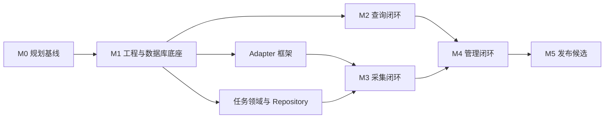

# 市场资讯服务实施计划

> 计划依据：本目录上级的领域、数据库、Adapter、采集流程、任务生命周期、API、运维与 Go 开发规范。  
> 当前状态：实施中。  
> 最近更新：2026-07-29

## 1. 使用方式

本计划将详细设计转换为可执行任务。任务状态使用：

- `TODO`：尚未开始。
- `READY`：依赖已满足，可以领取。
- `IN_PROGRESS`：正在实现，必须有唯一负责人。
- `BLOCKED`：存在明确阻塞条件，需记录原因。
- `DONE`：产出、测试和完成条件全部满足。

任何任务只有同时满足“输出、测试、完成条件”才可标记 `DONE`。覆盖率达标不能替代业务边界、并发和事务测试。

## 2. 专题计划

1. [工程基础与数据库](./01_foundation_and_database.md)
2. [领域模型与公共查询 API](./02_domain_and_query_api.md)
3. [Provider、采集 Worker 与 Scheduler](./03_ingestion_and_scheduling.md)
4. [管理 API、前端与可观测性](./04_admin_frontend_observability.md)
5. [测试、CI 与发布验收](./05_quality_and_release.md)

## 3. 里程碑

| 里程碑 | 目标 | 退出条件 |
| --- | --- | --- |
| M0 规划基线 | 设计映射为可执行任务 | 本实施计划通过评审，首期范围和未决项可追踪 |
| M1 工程与数据库底座 | 服务可连接并迁移空 PostgreSQL | migration 可重复执行；真实 `/readyz`；二进制可启动；质量门禁通过 |
| M2 查询闭环 | 从 PostgreSQL 查询主数据、最新价和 K 线 | 三个公共查询 API 契约通过；多来源不覆盖；分页稳定 |
| M3 采集闭环 | Provider 数据经 Task 安全落库 | Bybit、Longbridge 最小采集链路；事务、重试、租约、取消测试通过 |
| M4 管理闭环 | 可配置、观察和操作采集任务 | 订阅、Run/Task、backfill/retry/cancel、Provider 状态及管理页可用 |
| M5 发布候选 | 可重复部署和运行 | Compose 冷启动、全量测试、Provider smoke test、备份恢复与验收清单通过 |

## 4. 关键依赖

## 5. 并行波次

| 波次 | 可并行工作 | 必须先冻结 |
| --- | --- | --- |
| W1 | migration 基础设施、领域类型与 Repository 契约、HTTP 公共组件 | migration/驱动/decimal/UUID 技术决策 |
| W2 | 初始 DDL、Compose PostgreSQL、公共查询 Service（fake repository）、Adapter 框架 | 表名与领域 DTO |
| W3 | 主数据/行情 Repository、三个公共查询 API、Bybit 与 Longbridge Adapter | Repository 接口和 Provider 错误模型 |
| W4 | Worker、Scheduler 纯时间窗口算法、管理 API、前端 mock 页面 | Task 状态机、事务接口和 API 契约 |
| W5 | Scheduler 集成、管理页联调、指标与告警 | Worker 最终提交和 Run 汇总语义 |
| W6 | 端到端集成、性能基线、发布验收 | 功能冻结，只接受缺陷修复 |

同一波次并行不代表可以绕过依赖。共享接口、migration、`go.mod/go.sum`、路由注册、Compose 和 CI 文件由整合负责人统一修改。

## 6. 当前进度

| 任务 | 状态 | 说明 |
| --- | --- | --- |
| ENG-001 Go 开发规范 | DONE | 已建立单元测试与覆盖率要求 |
| ENG-002 Go module 与目录骨架 | DONE | 已创建独立 module |
| ENG-003 配置、HTTP 生命周期、health handler | DONE | 使用可注入 readiness checker；真实数据库装配纳入 DB-007 |
| ENG-004 运行模式与依赖装配 | DONE | `serve/worker/all`、Adapter Registry、Scheduler 周期驱动、Worker 和协作式退出已完成 |
| DB-004 Migration 基础设施 | DONE | 嵌入式 goose migration、迁移 CLI、重复执行和版本兼容 checker 已通过 |
| DB-006 本地 PostgreSQL | DONE | Colima/Docker Compose 冷启动、迁移、重启保留数据已验证 |
| DB-007 连接池与真实 readyz | DONE | pgxpool 配置解析、启动 Ping、真实 `/readyz=200/503` 与故障语义集成测试通过 |
| QA-001 基础质量门禁 | DONE | `gofmt`、`vet`、coverage、race；覆盖率持续保持不低于 80% |
| PLAN-001 可执行实施计划 | DONE | M2～M4 功能切片及 ENG-004 运行装配已完成；CI 已具备安全前置、静态、coverage、race、隔离 PG 和构建门禁，剩余 ENG-006、DB-005/008、QA-006 与 M5 发布验收 |

## 7. 首期明确不做

- Redis、Kafka、Nacos、etcd 或 Kubernetes。
- 加密衍生品、账户、持仓、订单和资金流水。
- 批量 backfill 请求或按 Provider 分页拆出大量 Task。
- 盘前盘后美股新鲜度监控。
- 查询时隐式触发采集。
- 自动探测 Provider 的管理接口。
- 完整 Idempotency-Key 平台；首期依靠业务唯一约束和状态冲突。

## 8. Agent 协作规则

- 同时最多 3 个执行 Agent 加 1 个整合 Agent；只有确实独立的任务才并行。
- 每个目录设置唯一写入者；子 Agent 不修改共享接口和统一装配文件。
- 子任务限定为一个纵向切片或 1–2 个文档章节，避免重复读取整套设计文档。
- 子 Agent 不提交 Git、不格式化无关文件；完成时报告变更文件、验证命令、风险和未决策项。
- 共享 DTO、Repository 接口、错误码和 migration 顺序先由整合负责人冻结，再并行实现。
