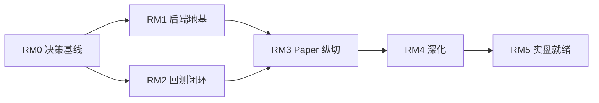

# XR-Trading 开发路线图与可执行任务链

> 依据：`doc/ai_quant_trading_system_requirements.md` 与 `doc/technical/` 各模块设计，以及 2026-08-04 的开发进度评估。
> 状态：实施中。
> 最近更新：2026-08-04

## 1. 背景与核心判断

行情服务（`market-info-service`，Go）已接近发布候选（M4→M5），工程质量高。但整条**决定平台价值的核心链路**——分析、策略、组合构建、风控、回测、执行、估值、报告——目前仅有设计文档，尚无代码；核心后端（`backend/`，Python）仍是 stdlib + SQLite 单文件原型。

因此本路线图的第一原则是：**先打通最小端到端闭环，按「价值/风险」而非「难易」排序，停止继续加深已够用的行情服务。**

## 2. 优先级总纲

| 优先级 | 主题 | 目的 |
| --- | --- | --- |
| P0 | 关键决策解锁 | 关掉阻塞下游的待定项（标的、日切、精度、后端架构），成本低、解锁面大 |
| P1 | 核心后端架构地基 | 把单体原型升级为领域分包，落地组合估值与行情服务集成 |
| P2 | 回测引擎 | 零资金风险验证策略 + 风控逻辑，倒逼策略/风控接口定型 |
| P3 | 最小端到端纵切（paper） | 让 1–2 标的完整走通「数据→信号→风控→模拟单→估值→日报」 |
| P4 | 深化与实盘就绪 | 完善风控/策略/报告，行情服务 M5 最小收尾，实盘切换评估 |

## 3. 里程碑

| 里程碑 | 目标 | 退出条件 |
| --- | --- | --- |
| RM0 决策基线 | 关键待定项冻结 | 标的清单、估值日切/时区、精度规则、后端架构方向均有书面结论 |
| RM1 后端地基 | 核心后端按领域分包并集成行情服务 | 领域骨架就位；组合估值/持仓/现金/汇率快照可生成；行情采集范围由组合驱动 |
| RM2 回测闭环 | 可复现的日线回测 | 固定输入结果可复现；逐日对账资金/持仓/成交/权益；复用同一套策略/风控代码 |
| RM3 Paper 纵切 | 端到端最小闭环跑通 | 1–2 标的完成 数据→指标→信号→风控→长桥模拟单→持仓/估值→日报；审计链路可串联 |
| RM4 深化 | 风控/策略/报告成体系 | 风控服务、策略实验室、报告体系达 MVP；行情 M5 最小收尾 |
| RM5 实盘就绪 | 满足实盘切换条件 | 连续 30 有效交易日模拟 + 对账达标 + 无重复下单/未知订单 + 人工确认记录 |

## 4. 依赖关系

回测（RM2）与后端地基（RM1）在 RM0 冻结后可并行；两者都是 Paper 纵切（RM3）的前置。

## 5. 任务链专题文档

1. [P0 关键决策解锁](./01_decisions.md)
2. [P1 核心后端架构地基](./02_backend_foundation.md)
3. [P2 回测引擎](./03_backtest_engine.md)
4. [P3 最小端到端纵切（Paper）](./04_e2e_paper_slice.md)
5. [P4 深化与实盘就绪](./05_deepen_and_live_readiness.md)

## 6. 任务约定

- 任务状态：`TODO` / `READY` / `IN_PROGRESS` / `BLOCKED` / `DONE`（见 `.claude/standards/development-workflow.md`）。
- 任一任务须同时满足「输出 + 测试 + 完成条件」才可 `DONE`。
- 遵循文档驱动 + 多 Agent 分波协作：共享接口/迁移/契约先冻结再并行。
- 每个任务标注：ID、优先级、依赖、输出、测试、完成条件。

## 7. 建议执行顺序（速览）

先做 RM0 全部决策 → 并行启动 RM1 后端地基与 RM2 回测引擎 → 汇合到 RM3 Paper 纵切 → 再进入 RM4 深化与 RM5 实盘就绪。**在 RM3 跑通前，不投入资源继续打磨行情服务 M5 之外的能力。**

RM0 已完成（见 `01_decisions.md`）。RM1、RM2 的可执行任务已细化为多 Agent 分波协作计划，见 [核心后端实施计划](../implementation_plan/README.md)（结构参照 `market_information_service/implementation_plan/`）。
